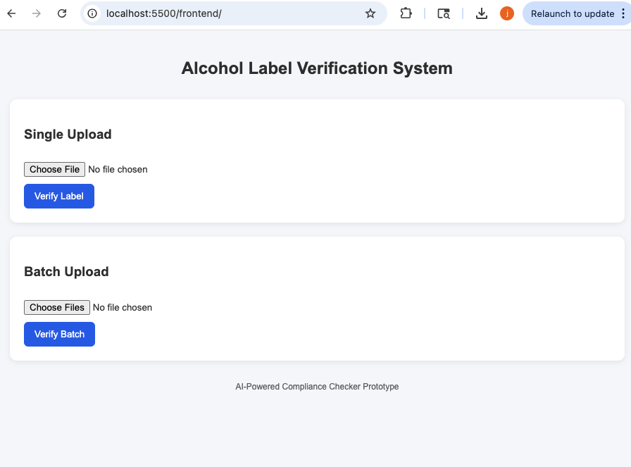
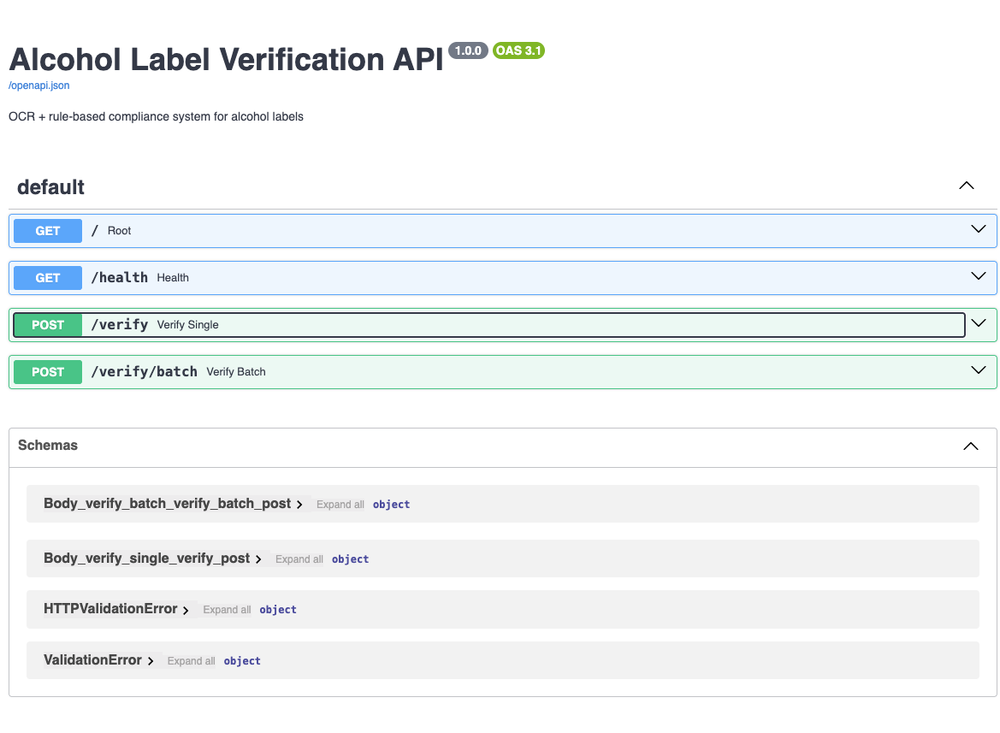
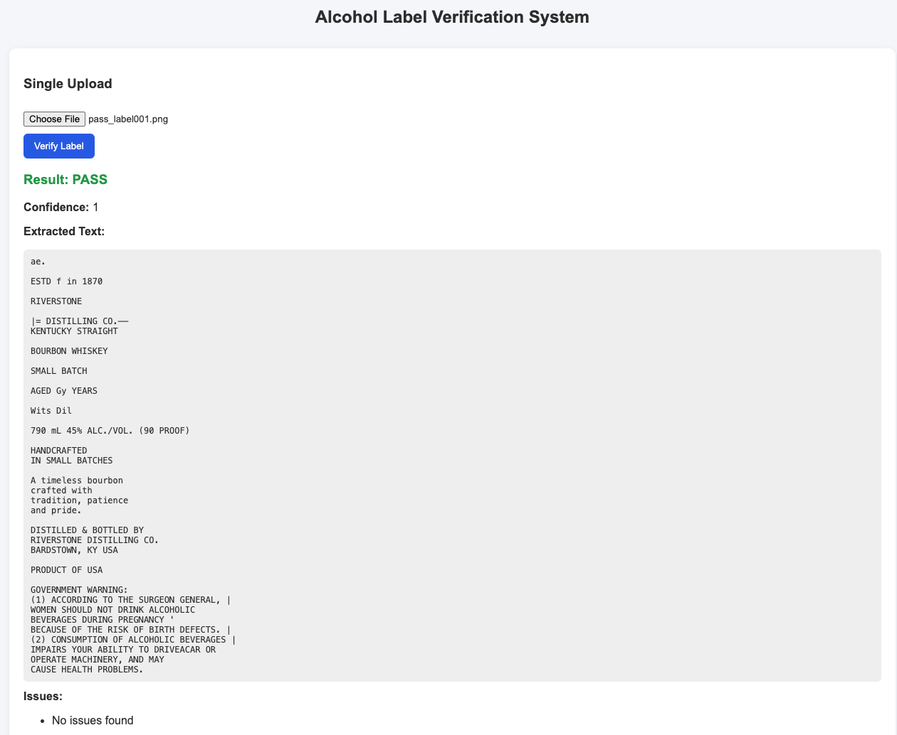
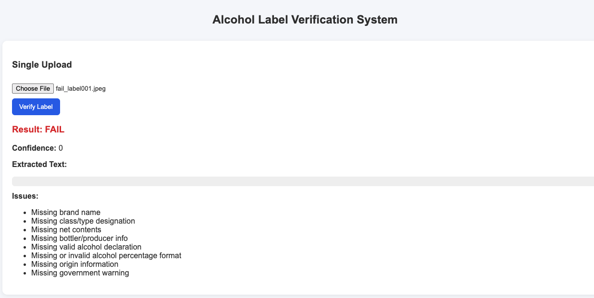
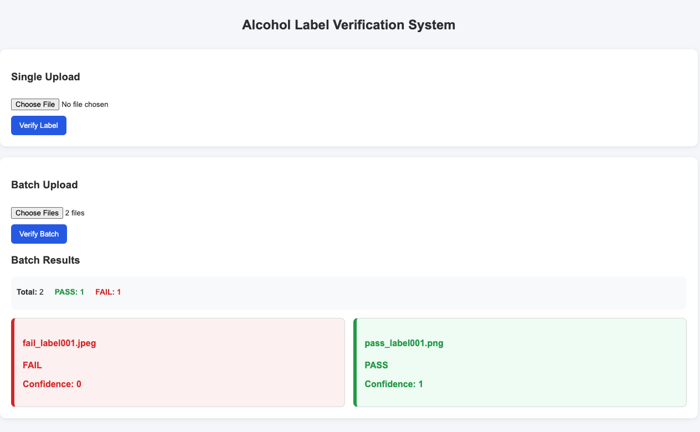
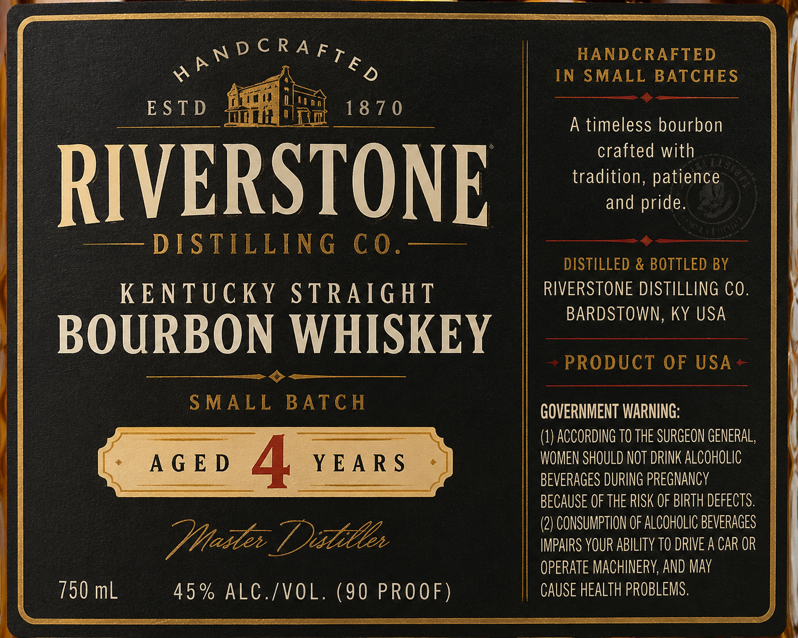
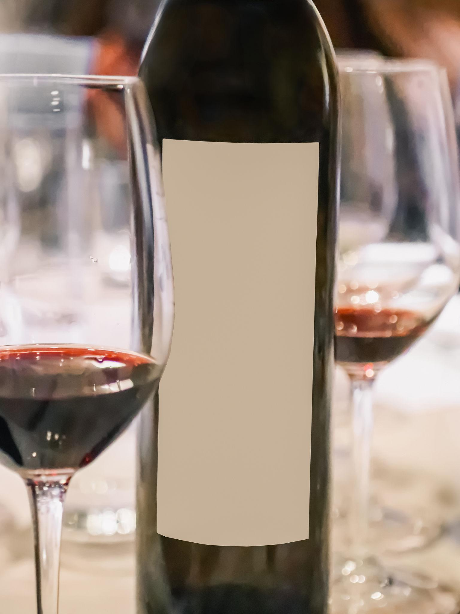

# 🍾 Alcohol Label Verification System

An OCR + rule-based compliance checker for alcohol beverage labels using FastAPI.

---

## 🚀 Features

- Image upload (single & batch)
- OCR text extraction (Tesseract)
- Rule-based compliance validation
- Confidence scoring
- FastAPI backend

---

## ▶️ Run Locally

### Backend
uvicorn main:app --reload

http://127.0.0.1:8000/docs

### Frontend
http://localhost:5500

---

## 📸 Screenshots

### 1. Frontend Upload Page

### 2. Swagger API (FastAPI Docs)

### 3. Valid Label Result

### 4. Invalid Label Result

### 5. Batch Upload Result

---

## 📸 Demo

### Example PASS Case

### Example FAIL Case

---

## 🧠 Notes

- OCR accuracy depends on image quality
- Government warning must include keyword "GOVERNMENT WARNING"
